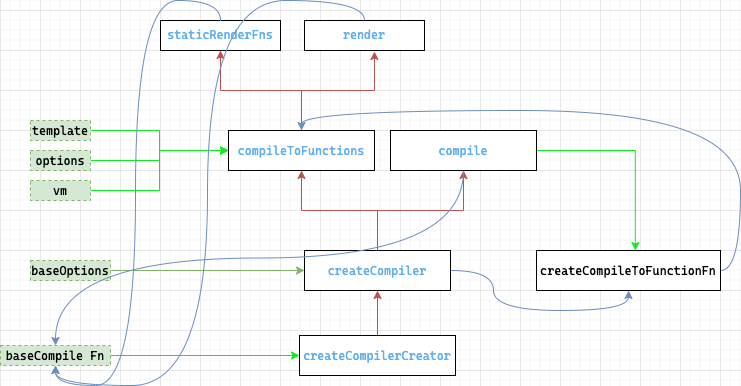

# 8.compiler【解析】的实现原理

## $mount 的实现
1. 在 `runtime/index` 中 第一次定义了该方法
   1. 接收两个参数`el`（dom字符串/dom元素） `hydrating` 属性
   2. 如果`el`存在，并且是浏览器环境 则直接调用 `query` 通过dom方法找到该元素
   3. 返回`mountComponent`的执行结果
2. 在 `web/index` 中重写了该方法
   1. 缓存上面定义的`$mount`方法
   2. 同样接收两个参数 `el和hydrating`
   3. 如果`el` 存在 通过`query`拿到挂载节点`Element`
   4. 判断 如果 `el`是 `body`或`html`节点 提示警告 并返回
   5. 拿到 `options`
   6. 判断`options.render`
      1. 如果不存在 获取 `template`属性 判断`template`
         1. 如果`template`存在
            1. 如果`template`是字符串
               1. 如果 `template`的第一个字符是`#`表示传入的是`id` 
               2. 调用`idToTemplate`方法 拿到挂载节点
               3. 如果通过 `idToTemplate` 未找到挂载节点 则提示 未找到`element`
            2. 如果`template.nodeType`存在 通过`innerHtml`拿到 挂载节点
            3. 否则 提示为传入的`template`非法
         2. 如果 `el` 存在 调用 `getOuterHtml` 拿挂载节点
      2. 判断上面一系列流程后的`template`是否存在 如果不存在直接到最后调用 `mount`
      3. 如果存在
         1. 通过`compileToFunctions`方法 拿到 `render`函数和 `staticRenderFns`静态树
         2. 传递的参数配置项`options`
            1. `outputSourceRange` 是否在编译时记录标签属性在模版字符串中开始和结束的位置索引 
            2. `shouldDecodeNewlines` 处理 IE 浏览器的行为 （忽略）
            3. `shouldDecodeNewlinesForHref` 处理 IE 浏览器的行为 （忽略）
            4. `delimiters` 界定符 默认不传为空
            5. `comments` 是否保留注释 默认不传为空
         3. 并将其保存在`options`上
   7. 最后调用 刚刚缓存的方法 `mount`


### 关于 `render` `el` `template` 的优先级
1.  `render` 函数最高, 会直接退出判断 调用 `mount`方法 后续会直接调用 `render`
2.  `template` 第二优先级 会先判断是否为`id` 通过`id`查找，再判断是否为`Element` 直接取`innerHtml`
3.  `el`为最后 通过`getOuterHtml`来获取


## `compileToFunctions` 将模版解析为 `render` 的过程



1.  找到 `compileToFunctions` 从 `web/compiler/index` 引入
2.  找到 `createCompiler` 从 `compiler/index` 引入
3.  找到 `createCompilerCreator` 从`compiler/create-compiler` 引入
4.  执行 `createCompilerCreator`
    1.   以 `baseCompile`为参数
    2.   返回一个 `createCompiler`函数 传入 `baseCompile` 为参数
5.  执行 `createCompiler`
    1.  实际上就是执行 上一步`createCompilerCreator`的执行结果 并以`baseCompile`为参数
    2.  返回一个对象 `compile` 以及通过 `createCompileToFunctionFn`以`compile`为参数得到 `compileToFunctions`
6.  执行 `createCompileToFunctionFn` 将上一步定义的`compile`函数传入为参数
    1.  返回一个函数 `compileToFunctions` 内部会执行`compile`
7.  `compile`定义 在 **5**
    1.  内部会执行 `baseCompile` 函数
8.  `baseCompile` 定义  **4**
    1.  解析`template` 得到ast 并通过`generate`得到 `render,staticRenderFns`

### 执行的顺序
1.  在`$mount`中 执行 `compileToFunctions`的顺序
2.  `createCompilerCreator`
3.  `createCompiler`
4.  `createCompileToFunctionFn`
5.  `compileToFunctions`

## 解析
1.  直接从`createCompiler`为入口
2.  接收一个参数 `baseOptions` (web端参数)
```js 
    // 传入位置在`web/compiler/index.ts` 
    const { compile, compileToFunctions } = createCompiler(baseOptions)
```
3.  定义 `compile`函数  查看  **`compile` 的实现**
4.  通过`createCompileToFunctionFn` 生成 `compileToFunctions`  查看 **`compileToFunctions` 的实现**
5.  返回一个对象 `{ compile, compileToFunctions }`

### `compileToFunctions` 的实现
1.  `createCompileToFunctionFn`接收参数 `compile` 函数 并返回 `compileToFunctions`
2.  返回`compileToFunctions`函数
3.  `compileToFunctions`的定义
    1.  接收参数 `template/options/vm` 在 $mount 方法中传入
    2.  保存`warn`函数 并从`options`中删除 （忽略）
    3.  尝试`new Function`是否可用 （忽略）
    4.  查看缓存是否存在
        1.  定义 `key` 从`options.delimiters` 中去值
        2.  存在则 和 `template` 拼接
        3.  否则直接返回 `template`
        4.  再从 cache 中查询是否存在缓存 存在则直接返回缓存
    5.  执行 `compile`函数 传入`template options`  拿到编译后的结果 `compiled` **`compile` 的实现**
    6.  检查 `compiled` 编译接到产生的错误和提示
    7.  通过 `createFunction` 函数 创建 `render` 和 `staticRenderFns`
    8.  进行缓存 并返回

### `compile` 的实现
1.  接收参数 `template options` 
2.  拿到`createCompilerCreator`传入的 `baseOptions`
3.  定义`warn`函数
4.  判断options
5.  存在options 合并 `modules` `directives` 及其他选项
6.  执行`baseCompile`(从`createCompilerCreator`中传入的函数) 传入`template` 及配置项 拿到 `compiled` 查看 **`baseCompile` 的实现**
7.  返回 `compiled`


### `createFunction` 的实现
返回 `new Function(code)`
### `baseCompile` 的实现
1.  接收参数 `template options`
2.  调用 `parse` 解析 `template`
3.  `optimize`是否存在 存在执行 `optimize`
4.  通过`generate` 将 `ast` 转换为可执行的 `render` 函数的 字符串形式
5.  返回 `ast render staticRenderFns`

### baseOptions 具体实现
1. `expectHTML` 是否期望得到HTML
2. `modules` 处理 `class style v-model`
3. `directives` 处理指令 
4. `isPreTag` 是否为Pre标签
5. `isUnaryTag` 是否是自闭合标签
6. `mustUseProp` 规定必须使用`props`进行绑定的属性
7. `canBeLeftOpenTag` 可以只写开始标签的标签
8. `isReservedTag` 是否为保留标签
9. `getTagNamespace` 获取标签的命名空间
10. `staticKeys` 通过`genStaticKeys` 拿到 moudules的所有`staticKeys`为一个数组

## `parse`【模版解析】的具体实现 ( html string => ast)
1. 从`options`拿到一些参数
   1. `warn` (外部)
   2. `platformIsPreTag = options.isPreTag` (外部)
   3. `platformMustUseProp = options.mustUseProp` (外部)
   4. `platformGetTagNamespace = options.getTagNamespace` (外部)
   5. `const isReservedTag = options.isReservedTag` (内部)
   6. 定义`maybeComponent`函数 判断是否为组件 (外部)
   7. 通过`pluckModuleFunction`拿到 modules中的 `transformNode、preTransformNode、postTransformNode` 赋值给 transforms/preTransforms/postTransforms (外部)
   8. `delimiters = options.delimiters` (外部)
   9. `const preserveWhitespace = options.preserveWhitespace`(内部)
   10. `const whitespaceOption = options.whitespace` (内部)
2. 定义变量
   1. `stack` 栈 解析的中间结果
   2. `root` ast根 最后解析都将挂到 `root`上 并返回
   3. `currentParent` 当前父级
   4. `inPre` 是否存在 `v-pre`
   5. inPre 是否是 `pre` 标签
   6. `warned` 错误 （忽略）
3. 定义方法
   1. `warnOnce`（忽略）
   2. `closeElement`
   3. `trimEndingWhitespace`
   4. `checkRootConstraints`
4. 调用`parseHTML`
5. 返回 `root`
   

## `parseHTML`的实现
1.  接收参数 `template` 模版字符串 `options` 选项配置
2.  传入的`options`
    1.  从`parse(template,options)`中的`options`取出的属性
        1.  warn
        2.  isUnaryTag
        3.  canBeLeftOpenTag
        4.  shouldDecodeNewlines
        5.  shouldDecodeNewlinesForHref
        6.  shouldKeepComment
        7.  outputSourceRange 
    2.  定义辅助函数
        1.  start
        2.  end
        3.  chars
        4.  comment
3.  定义 `stack` 栈 
4.  获取`options`的 `expectHTML/isUnaryTag/canBeLeftOpenTag`
5.  定义一个 `index/last/lastTag`
6.  遍历`html` 查看 **遍历`html`**
7.  定义方法
    1.  `advance`
    2.  `parseStartTag`
    3.  `handleStartTag`
    4.  `parseEndTag`
8.  执行 parseEndTag

### 遍历`html`
1.  `last`保存当前`html`
2.  如果`lastTag`不存在 或是 不是`script,style,textarea`标签
    1.  `textEnd` 从`html`找到'<'标签的索引位置
    2.  `textEnd` = 0
        1.  处理注释 `<!-- xxx ->`
            1.  `commentEnd` 找到注释的结束标识 `-->`
            2.  `commentEnd` 存在
            3.  如果 `shouldKeepComment` 为`true`
                1.  需要保留注释
                2.  调用 `comment` 进行创建 comment的 `ast`
            4.  调用 `advance` 对`html`进行剪切
        2.  处理注条件释 `<!--[if !IE]>-->`
            1.  与注释类似 不过不需要调用`comment` 创建 `ast`
        3.  处理 `Doctype` `<!DOCTYPE html>`
            1.  直接剪切忽略 不需要创建 `ast`
        4.  处理 结束标签
        5.  处理 开始标签
    3.  `textEnd` = >= 0
    4.  `textEnd` < 0
3.  否则

### `parseHTML` options中传入的四个辅助函数
1.  start
2.  end
3.  chars
4.  comment
    1.  接收参数`text`文本，start,end 开始结束索引
    2.  判断是否存在`currentParent` 不存在表示在最开始 直接忽略
    3.  创建 `ASTText` type为3
    4.  如果`outputSourceRange`为`true` 并且不是生产环境 `ASTText`挂载开始结束索引
    5.  将`ASTText`放入父节点的`children`

### `parseHTML` 函数内部定义的辅助函数
1.  `advance`
    1.  接收参数 n 表示剪切位数
    2.  并返回剪切后的`html`
2.  `parseStartTag`
    1.  正则匹配开始标签
    2.  如果存在
    3.  创建一个`match`对象
        1.  tagName 标签名
        2.  attrs 属性 空数组
        3.  start 当前索引
    4.  `advance` 裁剪
    5.  遍历 处理`attrs` 获取属性 放到 `match.attrs`中
    6.  如果`end`存在 `end = > 或者 end = />`
    7.  如果是自闭和标签 设置 unarySlash
    8.  `advance` 继续裁剪`end` 并给end赋值索引
    9.  返回 `match`对象
3.  `handleStartTag`
    1.  拿到`parseStartTag` 返回的`match`对象作为参数 解析`match`
    2.  拿到 `tagName unarySlash` 属性
    3.  
4.  `parseEndTag`