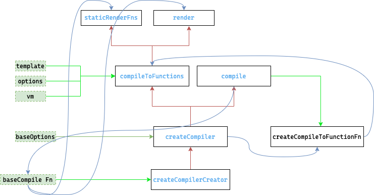

# 8.compiler【解析】的实现原理

## $mount 的实现
1. 在 `runtime/index` 中 第一次定义了该方法
   1. 接收两个参数`el`（dom字符串/dom元素） `hydrating` 属性
   2. 如果`el`存在，并且是浏览器环境 则直接调用 `query` 通过dom方法找到该元素
   3. 返回`mountComponent`的执行结果
2. 在 `web/index` 中重写了该方法
   1. 缓存上面定义的`$mount`方法
   2. 同样接收两个参数 `el和hydrating`
   3. 如果`el` 存在 通过`query`拿到挂载节点`Element`
   4. 判断 如果 `el`是 `body`或`html`节点 提示警告 并返回
   5. 拿到 `options`
   6. 判断`options.render`
      1. 如果不存在 获取 `template`属性 判断`template`
         1. 如果`template`存在
            1. 如果`template`是字符串
               1. 如果 `template`的第一个字符是`#`表示传入的是`id` 
               2. 调用`idToTemplate`方法 拿到挂载节点
               3. 如果通过 `idToTemplate` 未找到挂载节点 则提示 未找到`element`
            2. 如果`template.nodeType`存在 通过`innerHtml`拿到 挂载节点
            3. 否则 提示为传入的`template`非法
         2. 如果 `el` 存在 调用 `getOuterHtml` 拿挂载节点
      2. 判断上面一系列流程后的`template`是否存在 如果不存在直接到最后调用 `mount`
      3. 如果存在
         1. 通过`compileToFunctions`方法 拿到 `render`函数和 `staticRenderFns`静态树
         2. 并将其保存在`options`上
   7. 最后调用 刚刚缓存的方法 `mount`

### 关于 `render` `el` `template` 的优先级
1.  `render` 函数最高, 会直接退出判断 调用 `mount`方法 后续会直接调用 `render`
2.  `template` 第二优先级 会先判断是否为`id` 通过`id`查找，再判断是否为`Element` 直接取`innerHtml`
3.  `el`为最后 通过`getOuterHtml`来获取

## `compileToFunctions` 将模版解析为 `render` 的过程

1.  找到 `compileToFunctions` 从 `web/compiler/index` 引入
2.  找到 `createCompiler` 从 `compiler/index` 引入
3.  找到 `createCompilerCreator` 从`compiler/create-compiler` 引入
4.  执行 `createCompilerCreator`
    1.   以 `baseCompile`为参数
    2.   返回一个 `createCompiler`函数 传入 `baseCompile` 为参数
5.  执行 `createCompiler`
    1.  实际上就是执行 上一步`createCompilerCreator`的执行结果 并以`baseCompile`为参数
    2.  返回一个对象 `compile` 以及通过 `createCompileToFunctionFn`以`compile`为参数得到 `compileToFunctions`
6.  执行 `createCompileToFunctionFn` 将上一步定义的`compile`函数传入为参数
    1.  返回一个函数 `compileToFunctions` 内部会执行`compile`
7.  `compile`定义 在 **5**
    1.  内部会执行 `baseCompile` 函数
8.  `baseCompile` 定义  **4**
    1.  解析`template` 得到ast 并通过`generate`得到 `render,staticRenderFns`

